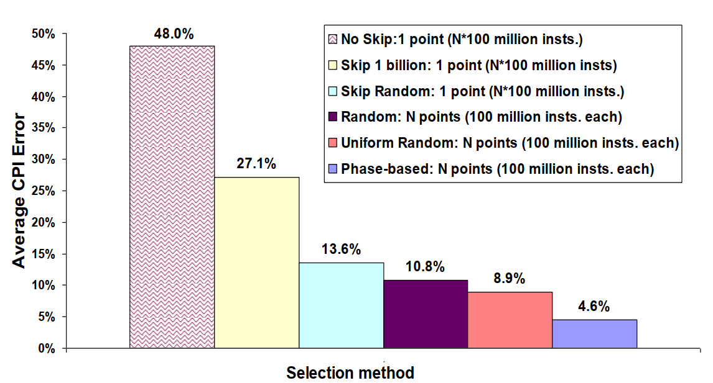
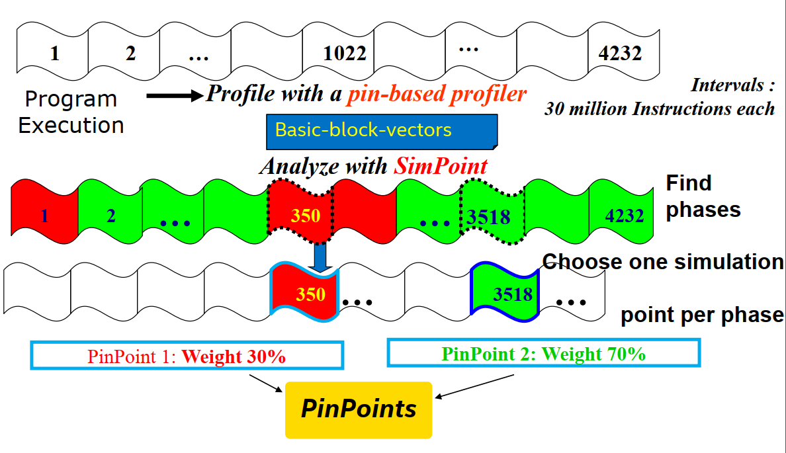
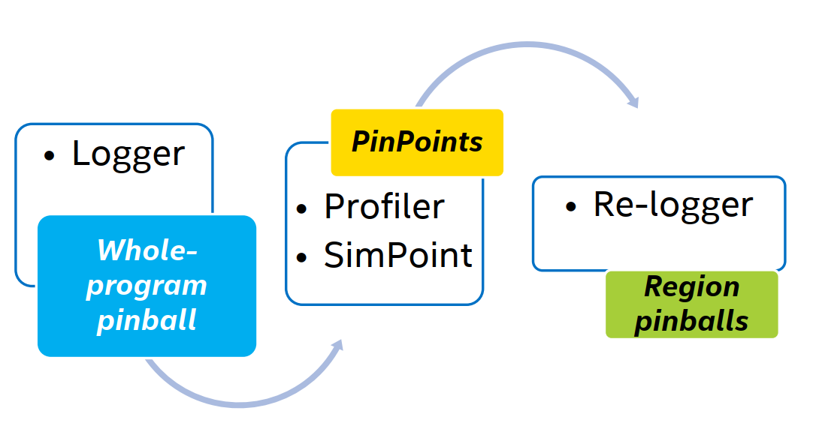

# pintools

## 简介
pintool是由Intel开发的二进制动态插桩工具，可以在程序运行时对程序的运行信息进行分析，支持Windows、Linux、MacOS多个平台。

### 插桩
插桩，就是在程序的某些位置插入跟踪代码，进行程序运行时信息的收集。通过插桩，我们可以测试一个程序的性能，可以定位程序错误，得到程序的控制流和数据流信息。

### 动态和静态
插桩在代码编写、编译、链接和运行阶段都可以进行，在编写、编译、链接过程中进行的插桩称为静态的，而运行期间进行的插桩是动态的。

### 源码插桩和二进制插桩
插桩可以在源代码上进行，也可以在二进制代码上进行，在源代码上进行的插桩就是源码插桩，在二进制代码就是二进制插桩。相对于源码插桩，二进制插桩具有以下几个优点：
1. 可以直接在可执行文件上进行，不需要源程序
2. 与程序使用的编程语言无关
3. 与编译工具无关
4. 插桩后的程序可以直接执行
5. 可以获取运行时的底层硬件信息
但是，相对源码插桩，二进制插桩也具有一些缺点：
1. 不能获取程序的高层信息，如变量名、函数名、类名以及类型等信息
2. 更难获得程序的上下文信息
3. 在二进制级别进行插桩更容易造成程序崩溃
4. 需要处理更多与系统相关的细节，更复杂
5. 平台相关，移植性差

### 二进制动态插桩
pin采用的是二进制动态插桩，这种方式不需要对二进制程序进行修改即可达到插桩的效果。相比于二进制静态插桩，这种方式能更好地分辨出二进制代码中的程序和数据，更好地获得程序相关的运行时信息。pin可以看作是一个JIT编译器，运行pin的过程就是对程序的二进制代码进行解释的过程。pin在运行时，会使用跳转指令对原指令作动态替换，如果是进行了插桩的指令，就会跳转到对应的解释函数，对该条指令进行解释，至于如何解释指令，则可以由用户自定义。Intel已经在pin工具中提供了一部分解释程序，pin工具提供了一部分API接口，可以让用户编写自己的解释函数，pin工具和这一部分解释程序就称为pintools。

### 插桩粒度
pin不仅仅可以在指令级别进行插桩，pin支持四种粒度的插桩：
* instruction instrumentation
* trace instrumentation
* routine instrumentation
* image instrumentation
trace级插桩是在基本程序块BBL上进行的。BBL通常的定义是单一入口，单一出口的程序块，但是在pin中，BBL的定义稍有不同。如以下switch语句：
```c
switch(i)
{
    case 4: total++;
    case 3: total++;
    case 2: total++;
    case 1: total++;
    case 0:
    default: break;
}
```
生成的汇编代码为
```asm
.L7:
        addl    $1, -4(%ebp)
.L6:
        addl    $1, -4(%ebp)
.L5:
        addl    $1, -4(%ebp)
.L4:
        addl    $1, -4(%ebp)
```
在这个例子中，共有四个基本块，每条加法指令都构成了一个基本块。但是在pin中，虽然基本块的数量仍然为四个，但是基本块的构成是程序在switch语句中的执行路径，如从.L7进入，基本块就为.L7,.L6,.L5,.L4 ，其余四个基本块依次类推。
routine级的插桩是在函数上进行，image级的插桩在进程映像上进行。
以下主要就指令集插桩进行介绍。

## pintool使用

### 下载
pintools可以在Intel官网进行下载：https://software.intel.com/content/www/us/en/develop/articles/program-recordreplay-toolkit.html。要注意的是pintools有包含pinplay和不含pinplay的版本。

### 调用方法

pin的基本调用方法如下所示：
```
    pin -t xxx.so -- command
```
xxx.so是用户自定义或者Intel提供的pintool程序，经过编译后产生动态链接库，在使用时通过-t参数告诉pin使用哪一个pintool。最后的command参数就是待插桩程序的运行命令，包括程序路径和参数。

### 使用实例
Intel在pintools工具中提供了一个指令计数的例子，对于刚接触pin的用户来说，是最好的入门例子。
在pintool的目录下，进入/source/tools/ManualExamples目录，打开inscount0.cpp，文件内容如下：

```cpp
ofstream OutFile;

// The running count of instructions is kept here
// make it static to help the compiler optimize docount
static UINT64 icount = 0;

// This function is called before every instruction is executed
VOID docount() { icount++; }
    
// Pin calls this function every time a new instruction is encountered
VOID Instruction(INS ins, VOID *v)
{
    // Insert a call to docount before every instruction, no arguments are passed
    INS_InsertCall(ins, IPOINT_BEFORE, (AFUNPTR)docount, IARG_END);
}

KNOB<string> KnobOutputFile(KNOB_MODE_WRITEONCE, "pintool",
    "o", "inscount.out", "specify output file name");

// This function is called when the application exits
VOID Fini(INT32 code, VOID *v)
{
    // Write to a file since cout and cerr maybe closed by the application
    OutFile.setf(ios::showbase);
    OutFile << "Count " << icount << endl;
    OutFile.close();
}

/* ===================================================================== */
/* Print Help Message                                                    */
/* ===================================================================== */

INT32 Usage()
{
    cerr << "This tool counts the number of dynamic instructions executed" << endl;
    cerr << endl << KNOB_BASE::StringKnobSummary() << endl;
    return -1;
}

int main(int argc, char * argv[])
{
    // Initialize pin
    if (PIN_Init(argc, argv)) return Usage();

    OutFile.open(KnobOutputFile.Value().c_str());

    // Register Instruction to be called to instrument instructions
    INS_AddInstrumentFunction(Instruction, 0);

    // Register Fini to be called when the application exits
    PIN_AddFiniFunction(Fini, 0);
    
    // Start the program, never returns
    PIN_StartProgram();
    
    return 0;
}
```
main函数的格式基本固定，首先使用PIN_Init进行初始化，函数原型为
```c
BOOL LEVEL_PINCLIENT::PIN_Init	(	INT32 	argc,
CHAR ** 	argv 
)	
```
PIN_Init需要传入main函数的参数。
这里最后的输出写入了文件，因此声明了一个输出流。
第二是INS_AddInstrumentFunction函数，函数原型为
```c
PIN_CALLBACK LEVEL_PINCLIENT::INS_AddInstrumentFunction	(	INS_INSTRUMENT_CALLBACK 	fun,
VOID * 	val 
)	
```
这个函数可以添加一个指令级的插桩函数。在使用时，需要传入一个回调函数，类似于上面的Instruction函数，这个函数的名称可自定义，但格式固定如下
```c
VOID Instruction(INS ins, VOID *v)
```
第一个参数就是指令本身，会把指令相关的数据结构传进来。在INS_AddInstrumentFunction中传入的第二个参数，就是Instruction函数的第二个参数，用户需要自定义的参数都需要通过这个指针传进来，如果超过一个需要自己包装一个结构。在这个例子中，不需要使用Instruction函数的其他参数，所以直接传的0。
在本例中Instruction函数的定义为：
```cpp
VOID Instruction(INS ins, VOID *v)
{
    // Insert a call to docount before every instruction, no arguments are passed
    INS_InsertCall(ins, IPOINT_BEFORE, (AFUNPTR)docount, IARG_END);
}
```
INS_InsertCall的函数原型为：
```c
VOID LEVEL_PINCLIENT::INS_InsertCall	(	INS 	ins,
IPOINT   	action,
AFUNPTR 	funptr,
 	... 
)	
```
这是一个可变参数的函数。第一个参数是指令，第二个参数是一个IPOINT的枚举类型，第三个参数是一个回调函数，最后是用户自定义需要传入的值，参数列表的结尾一定需要传入IARG_END，表示参数的结束。
IPOINT枚举类型有四个成员：
    * IPOINT_BEFORE
    * IPOINT_AFTER
    * IPOINT_ANYWHERE
    * IPOINT_TAKEN_BRANCH
通过IPOINT指定了第三个参数传入的函数的执行时间，可以在指令执行前、执行后、任意时间、只在分支跳转时执行。
第三个参数传入的回调函数才是用户自定义功能的插桩函数，在这个例子中实现的是一个计数函数docount，每调用一次，计数值加一。
第三，在main函数中的PIN_AddFiniFunction函数。这个函数的参数和INS_AddInstrumentFunction相同，需要传入一个回调函数和回调函数的参数。传入的回调函数会在应用执行完毕后调用，处理剩下的工作。
最后是调用PIN_StartProgram函数，开始进行程序插桩。

## pinplay使用

pinplay也是基于pin构建的pintool之一，通过pinplay可以记录下程序的执行流，生成的执行流文件格式为pinball，生成的pinball文件可以随时通过pintool进行回放，重现程序的执行流。

pinplay位于pintool目录下的/extras/pinplay目录下。pinplay目录下有两个目录比较有用
    * bin
    * scripts
bin中有pinplay的.so动态链接文件，scripts中有一些脚本文件，封装好了常用的pinplay功能。

### 程序录制
使用pinplay首先是需要对程序执行过程进行录制，生成pinball文件。bin目录下有一个文件pinplay-driver.so，这个就是pinplay进行程序录制所使用的pintool工具，我们可以不用这个.so进行程序录制，在scripts文件夹中已经有写好的脚本record.py可以调用，调用方式为
```shell
/path/to/record.py command
```
command就是所录制程序的执行命令。脚本还有一些额外的参数可以使用，具体参见脚本的帮助说明。如果不使用脚本，直接使用pin命令，可以使用如下命令
```shell
pin -t path/to/pinlay-driver.so -log -log:basename pinball/foo -- test-app
```
pinplay-driver位于pinplay的bin目录中。


### 程序回放
使用pinball进行程序回放时，可以使用录制时的.so，复原程序的执行过程，但我们一般会希望能分析程序的行为，得到一些程序的信息，所以回放时通常使用的是其他.so，如果需要自定义pinlay回放工具，与之前的pintool插桩有一些不同，需要在程序中添加如下代码：
```c
#include "pinplay.H"
PINPLAY_ENGINE pinplay_engine;
KNOB<BOOL> KnobPinPlayLogger(KNOB_MODE_WRITEONCE,
                      "pintool", "log", "0",
                      "Activate the pinplay logger");
KNOB<BOOL> KnobPinPlayReplayer(KNOB_MODE_WRITEONCE,
                      "pintool", "replay", "0",
                      "Activate the pinplay replayer");

main()
{
..
pinplay_engine.Activate(argc, argv,
      KnobPinPlayLogger, KnobPinPlayReplayer);
..
}

```

makefile中也需要添加一部分代码：
```makefile
PINPLAY_HOME=$(PIN_ROOT)/extras/pinplay/
PINPLAY_INCLUDE_HOME=$(PINPLAY_HOME)/include
PINPLAY_LIB_HOME=$(PINPLAY_HOME)/lib/$(TARGET)
EXT_LIB_HOME=$(PINPLAY_HOME)/lib-ext/$(TARGET)

CXXFLAGS += -I$(PINPLAY_INCLUDE_HOME)

linking: link in $(PINPLAY_LIB_HOME)/libpinplay.a,
    $(EXT_LIB_HOME)/libbz2.a, $(EXT_LIB_HOME)/libz.a 
$(CONTROLLERLIB) 
```
pintool工具编译成功后，可以通过如下方式调用
```shell
pin -xyzzy -reserve_memory pinball/foo.address -t your-tool.so
-replay -replay:basename pinball/foo -- $PIN_ROOT/extras/pinplay/bin/intel64/nullapp
```

## pinpoints
在体系结构研究中，通常需要对程序进行模拟运行，对完整程序的模拟花费的时间通常无法接受，所以，只能选择源程序的一些片段进行模拟。
问题就在于，如何对程序片段进行选择，如果选择的程序片段不具有代表性，那么最后仿真的结果当然不准确，对CPI的估计会产生比较大的误差。

pintool中提供了工具，可以生成程序片段的pinball文件，pintool也支持回放程序片段。pintools这一功能是基于pin和simpoint实现的。通过simpoint将程序分为各个phase，用pin生成程序的profile文件，根据profile从各个phase中挑选出合适的phase，将该phase对应的程序保存下来，通过这两个步骤产生的结果就是pinpoints。

### pinpoints生成
产生pinpoints的workfolw如下图所示：

首先通过pinplay工具产生整个程序的pinball，然后回放pinball文件，通过simpoint找到代表性程序段，最后重新录制形成这些程序段的pinball文件。

要生成pinpoints，首先需要创建一个配置文件，配置文件的范例如下：
```s
# Must include [Parameters] as the first non-comment line
[Parameters]
program_name: omnetpp
input_name: p10000-s10
command: ./dtlb5-lin64 -p10000 -s10
maxk: 5
mode: st
warmup_length: 1000000
prolog_length: 0
epilog_length: 0
slice_size: 3500000
pinplayhome: pinplay-1.3-pin-2.13-65163-gcc.4.4.7-linux
sniper_root: /home/tmstall/sniper-6.0
```
该文件中各个字段的意义如下：
program_name和input_name与产生的pinball文件的命名相关，不会影响pinball的采集过程。
command为需要采集的程序的调用命令。
maxk表示该次采集最多能生成的pinball文件个数
mode与线程数量有关，单线程选择st模式，多线程为mt
warmup_length、prolog_length为程序区域开始前的截取的一段代码，通常给0就行。
epilog_length为区域结束后的一段代码，也给0.
pinplay
然后，调用pinplay下的脚本：
```shell
sniper_pinpoints.py --cfg demo.cfg –l >& out_1.txt
```
-l参数生成的是整个程序的pinball，如果要生成程序片段，需要先使用
```shell
sniper_pinpoints.py --cfg demo.cfg –b >& out_2.txt
```
使用-b参数会使用simpoint生成程序基本块向量BBV，然后，继续使用生成的BBV来产生pinpoints：
```shell
sniper_pinpoints.py --cfg demo.cfg –s >& out_3.txt
```
最后，生成pinball文件
```shell
sniper_pinpoints.py --cfg demo.cfg –p >& out_4.txt
```
以上过程可以也使用一条命令直接完成，配置文件中的pinplayhome和sniper_root也不是必需的。
```shell
pinpoints.py --cfg demo.cfg --default_phases
```
